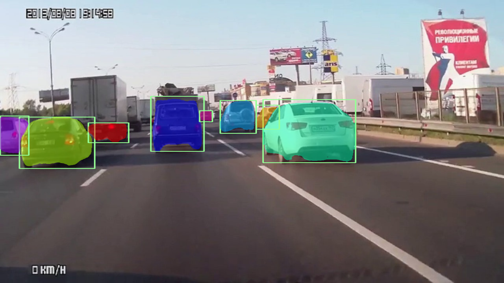
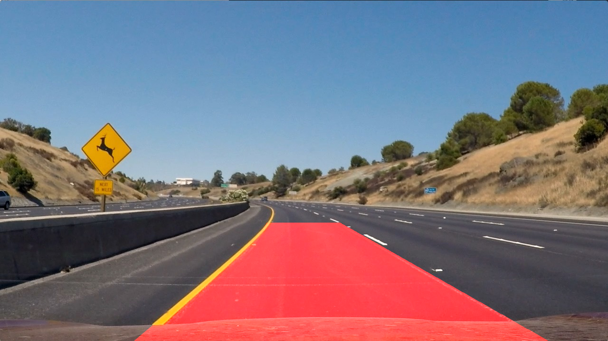

# Vehicle-Tracking-and-Lane-Detection
Vehicle Detection using Mask R-CNN and Computer Vision based Lane Detection

Implemented the [Mask R-CNN](https://arxiv.org/abs/1703.06870) using Keras and TensorFlow.
The model detects vehicles in the image frame using segmentation masks with the pretrained weights trained on COCO dataset; the lane detection is done using sobel filter.
This project is a part of Udacity Self-Driving Car Engineer program

Result image frames:

Mask R-CNN output on a road scene:

Land Identification output:

  
